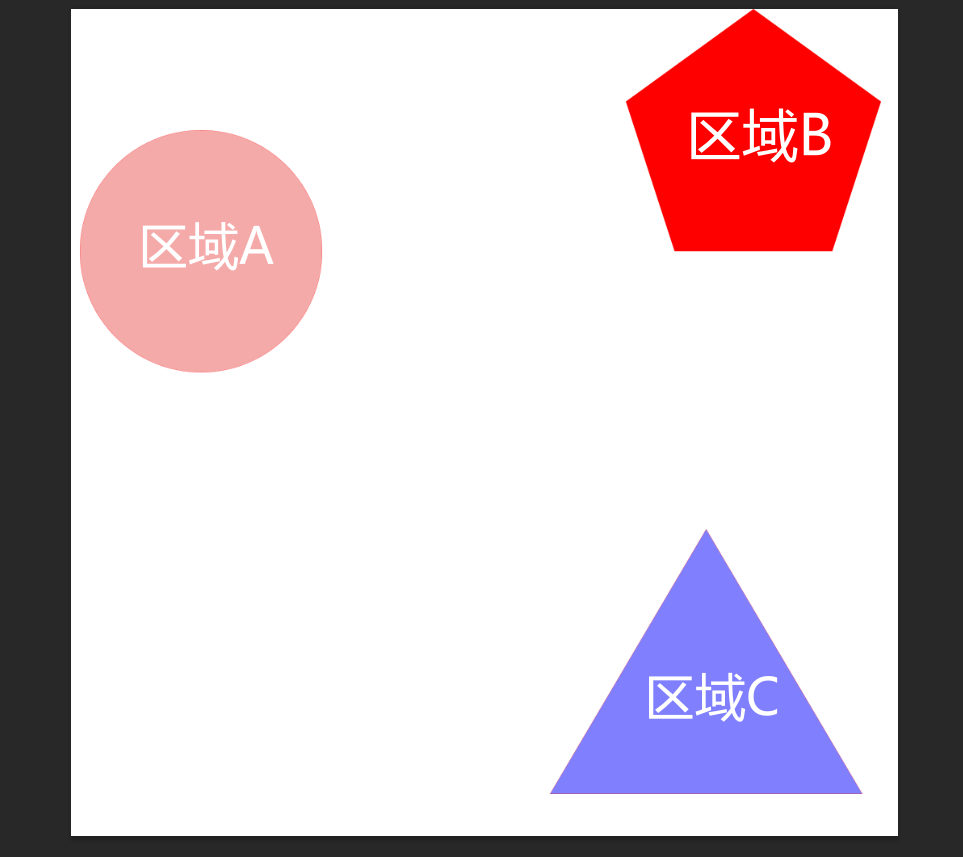
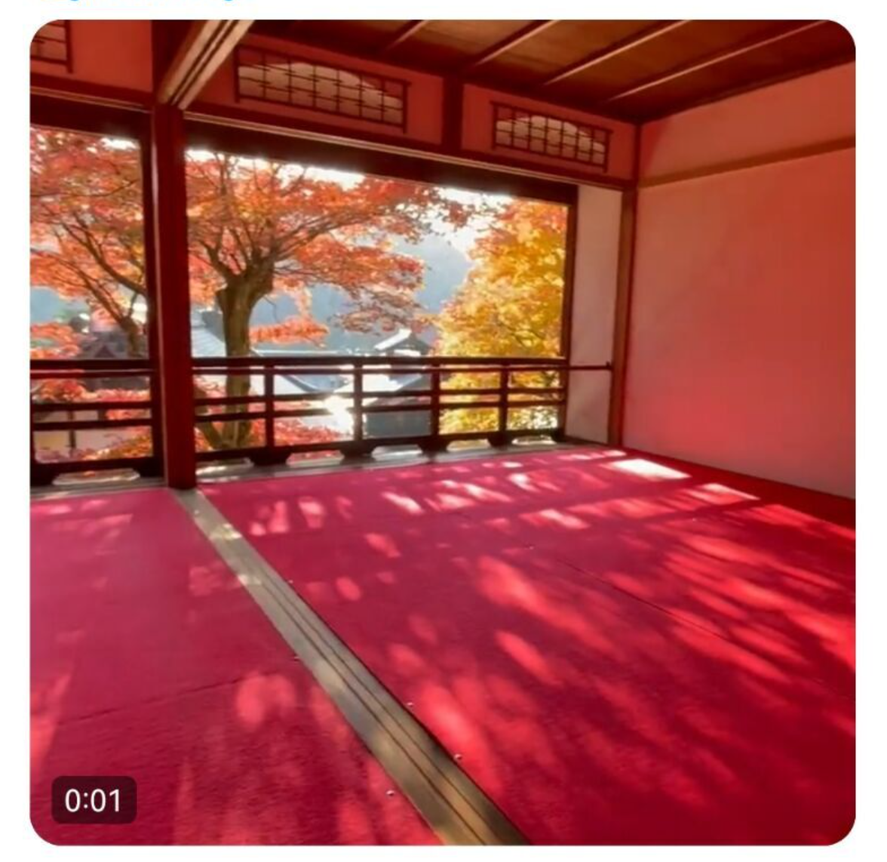

# My Legend-Game Polt
## 工作室
秘密基地(Secret Base Studio)，瞎想的，一个不存在的工作室~
## 这是什么？
这是关于我的游戏“我的传说(My Legend)”的游戏剧情策划
## 我是谁？
大家都称呼我为6君，一枚对美感有所追求的程序向技术美术，目前在上海游戏公司上班
## 为什么要做这么一款项目
想要成为有趣的人，做一些有意思的事情，想要做出满意的作品
## 玩法大概是什么样子？
玩法：箱庭探索解密+轻ACT+收集（看情况加钓鱼、种田什么之类的

为了控制场景量，我们决定采用箱庭场景，这样场景工作量不会很大，而且可以尽量保证场景的完成度和精细程度。

时期选在中世纪，因为中世纪的很多建筑很有特点，而且处于一个新旧时代的更替期间，可以同时存在新旧两种文化。

## 美术风格大概是想做出什么样子
日式幻想风，角色偏向于日韩角色，场景偏向碧蓝幻想relink，但是会更加的偏向卡通，写实会相较弱一些，整体饱和度偏低，对比度相对会中等偏高一些
角色：卡渲（后面会出福瑞角色
场景：PBR+风格化

### 场景设计
#### 流程

流程上应该是策划搭建关卡白模，也就是用unity的插件probuild大致的搭建一个box场景，然后用不同的颜色区分不同的东西，比如岩石什么颜色，树林什么颜色，水什么颜色
，确认下大方向是对的，然后再做细化的内容。

如果没什么思路可以多找相关的参考图，然后提取概括，搞出自己的一套。
#### 每个区域场景的主色调，以及视觉引导的主体和标志物
场景可以每个都有一个主色调。比如红色，就是枫叶谷或者枫叶林，配合日式建筑为主体

其中这个主体尽量能起到视觉引导的作用。比如饱和度，明度，建筑物的高度，或者大小对比来突出主体建筑。反正能达到突出的目的就可以

标志性物体。存档点、指示牌、小地图标记、宝箱。可以加一些闪光特效突出

同样的是不是也得有传送点。以塞达尔为例，是以高塔作为传送，把视觉引导的等级划分为城堡，高塔，还有啥来着。反正就是有几个视觉引导的划分

## 系统功能
- 体力系统
- 天气系统
- 背包系统
- 攀爬系统
- 战斗系统
- 集群系统
## 计划排期
目前打算先搞基本玩法，能用插件就用插件，快速开发，后面替换美术资源。但是第一个新手村要有个样式，可以通过一些临时资源拼凑起来。
打算先把新手村的部分做的大差不差，基本玩法+临时资源搭建的一个新手村的整体感觉。
## 为什么要放到Github？
想要更多的人的更多的想法参与到这其中，所谓“吾即是汝，汝亦是吾”，万人皆可为策划
## 一些注意事项
由于本人才疏学浅，难免存在纰漏，还望大佬们斧正
## 如果你有想法，欢迎提交新的pull或者联系我(qq:478385373)~ 我会根据情况选择合适的想法加入项目，项目如果上线会提名~
## 目前游戏中的剧情想法点子
- 出生的地方是自然场景的新手村庄
- 有着不同的组织、不同的种族，他们都有着各自的特征
- 陨石降落地球，里面有些神秘的元素，让地球的一些物质变异，产生了一种xxx的外表，人们因此取名叫做“星蚀”
- 有些物质因为星蚀产生了变异。有的失去了理智并获得了力量(根据受影响的程度，小怪或者BOSS)，有的并没有失去理智，得到了力量，其中就有主角
- 一开始主角还是在快乐的玩耍，突如其来的星蚀来袭，身边很多人都染上了星蚀病，他的父母(父母的经历神秘)告诉他，只有找到星蚀的源头，得到变异的原因，才能研发出抗体，解救苍生。主角为了把星蚀的源头找出，踏上了征程。
- 主角正在和青梅竹马一起在海边玩耍，突然村中发生变故，一群神秘人闯入，使用星蚀，给大家带来不幸，然后青梅竹马心急救人，自己被神秘组织抓走
- 但是他老婆留了一手，在走之前把手链给了主角，然后老婆会通讯魔法，但是因为神秘组织的干扰魔法，很多时候无法传递给主角信息
- 要不就是他父母被抓走了，因为他父母身份神秘。要不就是他老婆被抓走了，因为有特别稀缺的东西
- 中间他家的猫因为星蚀变异，变得非常的拟人，可以说话，可以听懂人说话，和他一起踏上征程
    - 为什么不是主人被抓走了，猫猫去救主人，猫猫还自学了主人书架上的工程书 自己造了一身机
- 我觉得老婆不能太后面出
- 而且主角需要同伴一起
    - 这个同伴，不一定是人，也可能是非生物物质，变异而来
- 整个世界星蚀泛滥
- 收集品(如塞尔达的呀哈哈)
- 寻找星蚀源头（后续可以根据情况来判断是否有大反转）
    - 疫情的一些情报？(每个区域会有一些线索，好让剧情继续)
    新手村线索-来自家中的老人，爷爷和奶奶被神秘组织攻击，主角赶到家中，和敌人产生了初次战斗，此时主角发现自己有了星灵之力，击败了敌人，爷爷和奶奶临近死亡，在气绝之前，将星蚀和父母的线索说出，主角为此踏上下一个目的地(确定几个区域名字)
- 主角的身世？
- 是有多个角色还是一个角色？
    - 战斗的时候只有一个角色，但是可以切换角色，根据剧情推荐，每个地区的角色即可解锁使用
- 是可选角色？
- 有些区域很奇怪，终日在雷雨中，有的则是地下，有的则是天上，有的四季都花开，有的则在海底
- 有些种族，收到了某种诅咒(比如：终日不得睡觉)
- ~~死亡的惩罚（如果打boss死了或者咋样，是不是得有一些惩罚）~~
    - ~~惩罚一般就是身上的道具因为上一场战斗吃了个精光,钱掉了,游戏挂了得再跑一段时间这种很难受但是不绝望的。~~ 想了想这里采用轻死亡惩罚的操作，存档即可，会回到存档位置，不会有其他损失
- 主角是汉子，养着一只猫

## 整理剧情
主体剧情：主角在快乐的玩耍，突如其来的星蚀来袭，身边很多人都染上了星蚀病，他的父母(父母的经历神秘)告诉他，只有找到星蚀的源头，得到变异的原因，才能研发出抗体，解救苍生。主角为了把星蚀的源头找出，踏上了征程。

线索：星蚀

由于星蚀，主角和BOSS发生了变异，赋有了新的能力，我们称之为“星灵之力”

每个角色都有专属的“星灵之力”，这个技能既可以作为解谜技能(比如，前面有藤曼挡住了去路，我们这里可以用火属性的星能之力去烧挡路的藤曼；再
比如前面出现了火灾，通过水属性的星能之力解救火灾，推动剧情发展)，也可以作为战斗技能(比如，金木水火土，属性克制之类的被动)

## 最后
感谢看到这里的你~